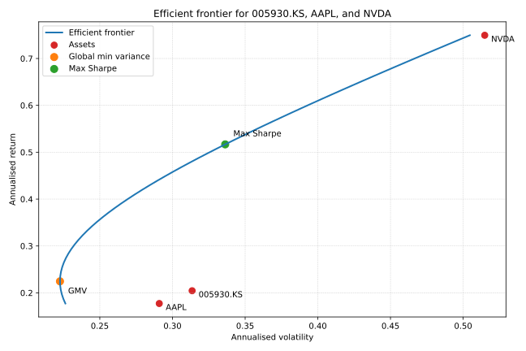

# temp.csv Stock Analysis

## Dataset overview
- **File**: `temp.csv` contains daily open-high-low-close-volume (OHLCV) records for Samsung Electronics (`005930.KS`), Apple (`AAPL`), and NVIDIA (`NVDA`). The header is stored across three rows: the first names each metric, the second lists the tickers, and the third labels the date column.【F:temp.csv†L1-L3】
- **Coverage**: Prices span from 16 October 2023 to 10 October 2025, providing 516 trading days of data. The earliest row captures 16 October 2023, while the latest row captures 10 October 2025.【F:temp.csv†L4-L6】【F:temp.csv†L510-L519】
- **Data gaps**: Samsung (`005930.KS`) quotes are missing for 34 of the trading days near the end of the sample (for example, 3–9 October 2025 only contain Apple and NVIDIA fields).【F:temp.csv†L514-L518】 All Apple and NVIDIA fields are present for 499 trading days each.

## Summary by ticker
| Ticker | Start close | End close | Total change | Average close | Lowest close | Highest close | Average volume | Peak volume |
| --- | --- | --- | --- | --- | --- | --- | --- | --- |
| 005930.KS | ₩64,781.67 (16 Oct 2023) | ₩94,400.00 (10 Oct 2025) | **+45.72%** | ₩66,471.53 | ₩48,968.97 (14 Nov 2024) | ₩94,400.00 (10 Oct 2025) | 19,481,205 shares | 57,691,266 shares (11 Jan 2024) |【F:temp.csv†L4-L6】【F:temp.csv†L65-L66】【F:temp.csv†L285-L286】【F:temp.csv†L519-L519】
| AAPL | $176.99 (16 Oct 2023) | $245.27 (10 Oct 2025) | **+38.58%** | $209.52 | $163.82 (19 Apr 2024) | $258.10 (26 Dec 2024) | 56,558,297 shares | 318,679,900 shares (20 Sep 2024) |【F:temp.csv†L4-L6】【F:temp.csv†L136-L137】【F:temp.csv†L246-L247】【F:temp.csv†L313-L314】【F:temp.csv†L519-L519】
| NVDA | $46.07 (16 Oct 2023) | $183.16 (10 Oct 2025) | **+297.59%** | $115.60 | $40.30 (26 Oct 2023) | $192.57 (9 Oct 2025) | 325,122,505 shares | 1,142,269,000 shares (8 Mar 2024) |【F:temp.csv†L4-L6】【F:temp.csv†L12-L13】【F:temp.csv†L106-L107】【F:temp.csv†L518-L519】

### Key observations
- NVIDIA delivered the strongest growth, with its closing price rising almost fourfold over the two-year window while also posting the highest trading volumes.【F:temp.csv†L4-L6】【F:temp.csv†L518-L519】
- Samsung and Apple both trended higher overall but with far smaller percentage gains than NVIDIA; Samsung’s sharpest drawdown occurred in November 2024 before rebounding to new highs by October 2025.【F:temp.csv†L4-L6】【F:temp.csv†L285-L286】【F:temp.csv†L519-L519】
- Volume spikes coincide with notable market events, such as Apple’s quarterly rebalancing surge on 20 September 2024 and NVIDIA’s March 2024 peak amid AI-related demand.【F:temp.csv†L106-L107】【F:temp.csv†L246-L247】 

### Working with the file
The multi-row header can be parsed as a three-level index (metric → ticker → date) when using data tools such as pandas. In plain CSV readers, skip the first two rows to obtain a wide table where each trio of columns corresponds to a ticker’s metric grouping.

## Efficient frontier analysis

- Close prices were converted to log returns after dropping days that were missing any ticker, then annualised to trace the mean–variance efficient frontier shown above.【F:efficient_frontier.py†L24-L158】
- The individual assets land below the frontier: Samsung offers a 20.5% expected return at 31.3% volatility, Apple 17.7% at 29.1%, and NVIDIA 75.0% at 51.5%.【9f2086†L1-L8】
- The global minimum-variance portfolio allocates about 44.1% to Samsung, 49.7% to Apple, and 6.2% to NVIDIA for a 22.5% expected return with 22.3% volatility.【9f2086†L9-L13】
- The maximum Sharpe solution tilts toward NVIDIA (57.7%) alongside 33.8% Samsung and 8.5% Apple to reach a 51.7% expected return at 33.6% volatility.【9f2086†L14-L18】
